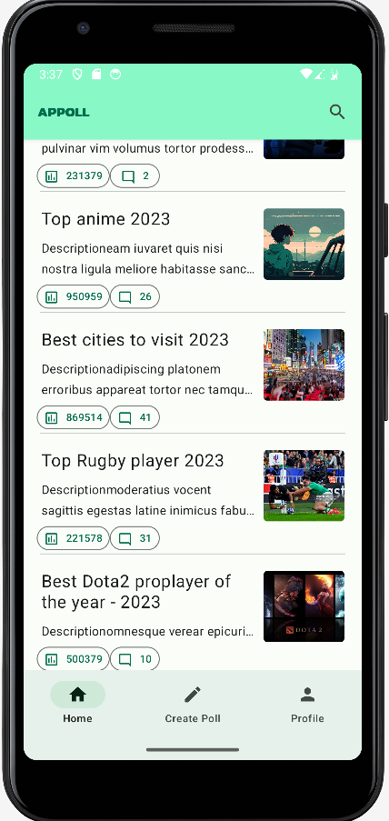

## "Appoll" Overview

"Appoll" is a simple application aimed at enabling global sharing of one's preferences. In Appoll, every user will have the opportunity to create rankings on any topic to know what the world thinks and publish them online. Other users will have the ability to interact with the rankings by upvoting/downvoting and commenting on the items within the rankings.

  

    ### HomeScreen
    
  

  

    ### PollScreen
    
  

## Roadmap

- [x] **Implementation of the HomeScreen:** 
  - Description: Users can view a list of existing rankings.
  - Completion Date: February 10, 2024
  
- [x] **Implementation of the PollScreen:** 
  - Description: Users are redirected to the PollScreen after selecting a ranking where they can vote for their favorite option.
  - Completion Date: February 10, 2024
  
- [x] **Implementation of Backend Security using Spring Boot:** 
  - Description: Security enhancements using Spring Boot in a new project named AppollBe. At the moment the system is running on a Render server.
  - Completion Date: March 18, 2024

- [ ] **Complete Poll Screen** 
  - Description: Update component layout and implement functionality to update like counters upon user interaction.
  - Target Completion Date: March 28, 2024
     
- [ ] **Implementation of the CreatePollScreen** 
  - Description: Users can create Polls.
  - Target Completion Date: End of April 2024

- [ ] **Implementation of the First REST APIs using Spring Boot:** 
  - Description: Initial REST APIs development using Spring Boot.
  - Target Completion Date: March 25, 2024
